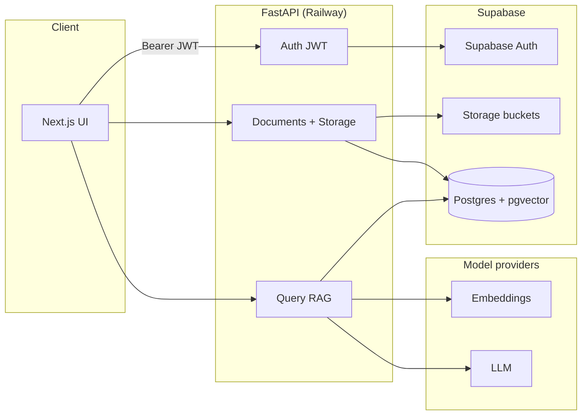

# IntelliDocs

**AI-powered document Q&A** with retrieval-augmented generation (RAG), **source citations**, and **per-user data isolation**. Built for a full-stack AI engineering take-home: modern UI, FastAPI backend, Supabase (Postgres + `pgvector` + Auth + Storage), and cloud deployment.

<p align="center">
  <a href="#-quick-start-local">Quick start</a> ·
  <a href="#-architecture">Architecture</a> ·
  <a href="#-environment-variables">Env vars</a> ·
  <a href="#-deployment">Deploy</a> ·
  <a href="#-demo-script">Demo</a>
</p>

---

## Features

| Area | What you get |
|------|----------------|
| **Auth** | Register / login via Supabase Auth; JWT verified on every protected API call |
| **Documents** | Upload PDF/TXT → chunk → embed → store in `pgvector`; list & delete with confirmation |
| **Chat** | Ask questions scoped to your documents; answers with **cited snippets** (filename, page, similarity) |
| **Resilience** | Embedding & LLM fallbacks when provider quotas fail; DB pool tuned for hosted Postgres |

---

## Tech stack

| Layer | Choice |
|-------|--------|
| **Frontend** | Next.js (App Router), TypeScript, Tailwind CSS |
| **Backend** | Python 3.13, FastAPI, Uvicorn |
| **Data** | Supabase PostgreSQL + **pgvector**, Supabase Storage, Supabase Auth |
| **AI** | OpenAI embeddings (384-dim), Grok / Anthropic / OpenAI for generation (configurable) |
| **Deploy** | Backend: Railway · Frontend: Vercel |

---

## Repository layout

```
├── backend/                 # FastAPI API
│   ├── app/
│   │   ├── api/routes/      # auth, documents, query
│   │   ├── core/            # config, db pool, auth, supabase
│   │   └── services/        # PDF extract, chunk, embed, ingest
│   ├── requirements.txt
│   └── .env.example
├── frontend/                # Next.js app
│   ├── src/app/             # pages: login, register, dashboard, chat, delete confirm
│   ├── src/lib/api.ts
│   └── .env.example
├── .gitignore
└── README.md                # ← you are here
```

---

## Architecture

Click the diagram to expand in GitHub — **Mermaid renders interactively** in the repo view.



**RAG flow (high level):** ingest → chunk text → embed chunks → `INSERT` into `chunks` with vectors → on question, embed query → similarity search **filtered by `user_id`** → build prompt with sources → generate answer → return answer + citation metadata.

---

## Quick start (local)

### Prerequisites

- **Node.js** 20+ (you used v24 — OK)
- **Python** 3.13
- Supabase project with: Auth enabled, Storage bucket, DB tables + `pgvector` (as in your assignment SQL)

### 1. Backend

```bash
cd backend
python -m venv venv
# Windows PowerShell:
.\venv\Scripts\Activate.ps1
pip install -r requirements.txt
cp .env.example .env   # then fill real values
uvicorn app.main:app --reload --host 127.0.0.1 --port 8001
```

- Health: [http://127.0.0.1:8001/health](http://127.0.0.1:8001/health)
- API docs: [http://127.0.0.1:8001/docs](http://127.0.0.1:8001/docs)

### 2. Frontend

```bash
cd frontend
cp .env.example .env.local
# Set NEXT_PUBLIC_API_BASE_URL to match your backend port, e.g.:
# NEXT_PUBLIC_API_BASE_URL=http://127.0.0.1:8001
npm install
npm run dev
```

Open [http://localhost:3000](http://localhost:3000).

---

## Environment variables

Copy from examples; **never commit** real `.env` files.

### Backend (`backend/.env`)

| Variable | Purpose |
|----------|---------|
| `SUPABASE_URL` | Project URL |
| `SUPABASE_ANON_KEY` | Public anon key (auth REST calls) |
| `SUPABASE_SERVICE_KEY` | Service role (storage / server-side) |
| `SUPABASE_STORAGE_BUCKET` | Bucket name (**case-sensitive**) |
| `JWT_SECRET` | Supabase JWT secret (HS256 path) |
| `DATABASE_URL` | Postgres connection string (`sslmode=require` recommended) |
| `FRONTEND_URL` | Public UI URL (email confirmation redirect + reference) |
| `OPENAI_API_KEY` | Embeddings (and optional chat fallback) |
| `LLM_PROVIDER` | `grok` \| `anthropic` \| `openai` |
| `GROK_API_KEY` / `GROK_MODEL` | xAI Grok when `LLM_PROVIDER=grok` |
| `EMBEDDINGS_PROVIDER` / `EMBEDDINGS_DIM` | Must match DB vector dimension (384) |

See full template: [`backend/.env.example`](backend/.env.example).

### Frontend (`frontend/.env.local`)

| Variable | Purpose |
|----------|---------|
| `NEXT_PUBLIC_API_BASE_URL` | Backend base URL (no trailing slash) |

See: [`frontend/.env.example`](frontend/.env.example).

---

## API overview

| Method | Path | Auth | Description |
|--------|------|------|-------------|
| `POST` | `/auth/register` | No | Sign up |
| `POST` | `/auth/login` | No | Sign in → `access_token` |
| `GET` | `/documents` | Bearer | List user’s documents |
| `POST` | `/documents/upload` | Bearer | Multipart upload + ingest |
| `DELETE` | `/documents/{id}` | Bearer | Remove document |
| `POST` | `/query` | Bearer | RAG question + sources |
| `GET` | `/health` | No | Liveness |

---

## Deployment

| Service | Root directory | Start command (typical) |
|---------|----------------|-------------------------|
| **Railway** | `backend` | `uvicorn app.main:app --host 0.0.0.0 --port $PORT` |
| **Vercel** | `frontend` | Default Next.js build |

1. Deploy **backend** first; copy public HTTPS URL.  
2. Set **Vercel** `NEXT_PUBLIC_API_BASE_URL` to that URL.  
3. Set **Railway** `FRONTEND_URL` to your Vercel URL (and Supabase **Site URL** + **Redirect URLs** for email links).  
4. Redeploy backend after env changes.

<details>
<summary><strong>Troubleshooting deploy</strong></summary>

- **CORS / “failed to fetch”** — confirm `NEXT_PUBLIC_API_BASE_URL` matches Railway; backend must be reachable; check Railway HTTP logs for `4xx/5xx`.
- **Email link goes to localhost** — Supabase Auth → URL Configuration → set **Site URL** to production; ensure `FRONTEND_URL` matches.
- **Bucket not found** — bucket names are **case-sensitive**; align `SUPABASE_STORAGE_BUCKET` with Supabase.
- **DB timeouts** — use pooler-friendly settings; this repo uses `psycopg` `ConnectionPool` with SSL and longer open timeout (see `backend/app/core/db.py`).

</details>

---

## Demo script (for reviewers)

1. Open live app → **Register** (or login).  
2. **Dashboard** → upload a PDF/TXT → wait until status **ready**.  
3. **Open Chat** → select document → ask a specific question.  
4. Show **Answer** + **Sources** (filename, page, similarity).  
5. **Delete** → confirm → success banner on dashboard.

---

## Scripts

| Where | Command | Purpose |
|-------|---------|---------|
| Frontend | `npm run dev` | Dev server |
| Frontend | `npm run build` | Production build |
| Backend | `uvicorn app.main:app --reload --port 8001` | Local API |

---

## Security notes

- Rotate keys if they were ever exposed (chat, screenshots, CI logs).  
- Service role key belongs **only** on the server (Railway), never in the browser.  
- For production hardening, replace wide-open CORS with an explicit allow-list of your frontend origin(s).

---

## License

This project was built for an AI engineering assessment. Use and adapt as needed for your portfolio.

---

<p align="center">
  <b>IntelliDocs</b> — Smart document Q&A with citations · Built with Next.js & FastAPI
</p>
