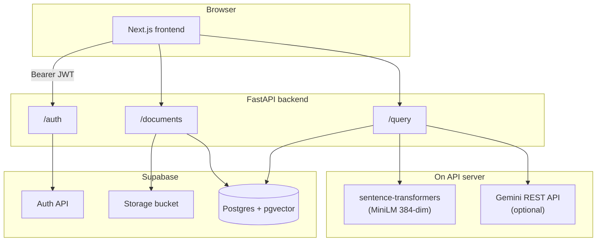

# IntelliDocs — project overview

This document describes **what IntelliDocs does** and **how the pieces fit together**. For setup commands and environment variables, see the [root README](../README.md). For Gemini/embeddings specifics and local debugging, see [GEMINI_AND_EMBEDDINGS.md](./GEMINI_AND_EMBEDDINGS.md) and [DEBUGGING_LOCAL.md](./DEBUGGING_LOCAL.md).

---

## What it is

IntelliDocs is a **document Q&A** application:

- Users **register and log in** (Supabase Auth).
- They **upload PDF or TXT** files; the backend **stores the file** and **indexes text** for search.
- They **ask questions** in a chat UI; the backend answers using **retrieval-augmented generation (RAG)** and returns **source citations** (which document, page, and chunk were used).

**Per-user isolation** is enforced everywhere: JWT identifies the user; database queries filter by `user_id` so one user cannot read another’s documents or chunks.

There is **no separate “auto summary” feature** in the codebase: answers are always **question-driven** (RAG over chunks, optionally refined by Google Gemini).

---

## High-level architecture

| Piece | Role |
|--------|------|
| **Next.js** (`frontend/`) | Login, register, dashboard (upload + list), chat (ask + show answer + sources). Stores Supabase `access_token` in `localStorage` and sends it as `Authorization: Bearer …` to the API. |
| **FastAPI** (`backend/app/`) | REST API: auth proxy, documents, RAG query. Verifies JWTs, talks to Postgres, Storage, and (for answers) local embeddings + Gemini. |
| **Supabase Auth** | Source of truth for users; backend proxies signup/login and validates tokens on protected routes. |
| **Supabase Storage** | Private bucket holds uploaded files under `{user_id}/{document_id}/{filename}`. |
| **Postgres + pgvector** | `documents`, `chunks` (with embedding vectors), `profiles`, `conversations`, `messages` — see [Data model](#data-model). |

---

## Repository layout (conceptual)

| Path | Responsibility |
|------|----------------|
| `backend/app/main.py` | FastAPI app, CORS, `/health`, mounts routers. |
| `backend/app/core/config.py` | Environment-driven settings (DB URL, Supabase keys, Gemini, embedding model). |
| `backend/app/core/db.py` | `psycopg` connection pool to Postgres. |
| `backend/app/core/auth.py` | `get_current_user`: validates Bearer JWT (JWKS first, then HS256 fallback). |
| `backend/app/core/supabase.py` | Service-role Supabase client for Storage. |
| `backend/app/api/routes/auth.py` | `POST /auth/register`, `POST /auth/login` → Supabase Auth REST. |
| `backend/app/api/routes/documents.py` | List/upload/delete documents; upload triggers ingestion. |
| `backend/app/api/routes/query.py` | `POST /query` — embed question, vector search, Gemini or extractive answer, persist messages. |
| `backend/app/services/pdfs.py` | PDF text extraction (per page). |
| `backend/app/services/chunker.py` | Whitespace-based chunks with overlap. |
| `backend/app/services/embeddings.py` | Local MiniLM embeddings (384 dimensions). |
| `backend/app/services/ingestion.py` | Orchestrates extract → chunk → embed → insert `chunks`. |
| `frontend/src/lib/api.ts` | Typed `fetch` helpers to the backend base URL. |
| `frontend/src/app/*` | App Router pages: `/`, `/login`, `/register`, `/dashboard`, `/chat`, delete confirmation. |

---

## Authentication flow

1. **Register** (`POST /auth/register`): FastAPI forwards credentials to Supabase `signup`. Optional email confirmation is supported; redirect after confirm uses `FRONTEND_URL` / `email_redirect_to`.
2. **Login** (`POST /auth/login`): Returns Supabase session `access_token`.
3. **Protected calls**: Browser sends `Authorization: Bearer <access_token>`.
4. **Verification** (`app/core/auth.py`): Token is verified with Supabase JWKS (typical for RS256) or, if that fails, with `JWT_SECRET` (HS256).

User id comes from JWT claim `sub` and is stored/compared as `user_id` on rows in Postgres.

---

## Document upload and ingestion

**Trigger:** `POST /documents/upload` with multipart files (PDF/TXT).

**Sequence:**

1. Ensure a **`profiles`** row exists for the user (upsert from JWT `sub` + email) so FKs from `documents` succeed.
2. For each file: insert **`documents`** row (`status = processing`), upload bytes to **Storage** at `{user_id}/{doc_id}/{filename}`.
3. Call **`ingest_document`** synchronously on the same request:
   - **PDF:** extract text per page (`pdfs` service); **TXT:** single synthetic “page 1”.
   - **Chunk** text (word-window chunking with overlap). Ingestion is **capped** (first 12 PDF pages, max 60 chunks) to bound CPU/time — see `ingestion.py`.
   - **Embed** each chunk with the **local** sentence-transformers model (384-dim vectors).
   - **Insert** rows into **`chunks`** with `document_id`, `user_id`, `content`, `embedding`, `chunk_index`, `page_number`.
4. On success, document **`status`** becomes **`ready`**. On ingestion failure, status is set to **`error`** and an HTTP 500 is returned.

**Delete:** `DELETE /documents/{id}` removes the DB row (chunks cascade), then best-effort removes the object from Storage.

---

## Query (RAG) flow

**Trigger:** `POST /query` with JSON: `question`, optional `document_id`, optional `conversation_id`, optional `top_k`.

**Steps:**

1. **Authenticate** user; optionally restrict vector search to one `document_id`.
2. **Embed** the question with the **same** local embedding model used at ingest.
3. **Similarity search** in Postgres: `chunks` joined to `documents`, `WHERE user_id = …`, `status = 'ready'`, order by vector distance (`<=>`), `LIMIT top_k` (default from config).
4. **Build context** from retrieved chunk texts (labeled with filename, page, chunk index). Context length is **truncated** (e.g. ~12k chars) to limit prompt size.
5. **Generate answer:**
   - If **`GEMINI_API_KEY`** is set: call **Google Gemini** `generateContent` with a short system prompt (“answer only from CONTEXT; otherwise say you don’t know”) and the user question + context.
   - If Gemini fails or is not configured: **extractive fallback** — largely from the top-retrieved chunk (keyword window), not a full multi-document synthesis.
6. **Response:** `answer` string + **`sources`** array (snippet, filename, page, similarity, ids).
7. **Persistence:** Creates or continues a **`conversations`** row and appends **`messages`** (user question + assistant answer with `source_chunks` JSON).

The frontend chat page does not yet pass `conversation_id` on every ask in a multi-turn UI sense; the backend still supports it for history storage.

---

## Data model (logical)

The SQL migrations live in your Supabase project (not all are vendored in this repo). Conceptually:

| Table / store | Purpose |
|---------------|---------|
| **Supabase Auth** | User accounts and sessions. |
| **`profiles`** | App-side mirror (`id` ↔ auth user, `email`) for FKs from `documents`. |
| **`documents`** | One row per upload: `user_id`, `filename`, `storage_path`, `status`. |
| **`chunks`** | Searchable segments: `content`, **`embedding`** (`vector(384)`), `chunk_index`, `page_number`, FK to `documents`. |
| **`conversations` / `messages`** | Chat history tied to user; assistant messages store citation metadata in `source_chunks`. |
| **Storage** | Raw files for durability/re-download; RAG uses **chunk text in Postgres**, not the file at query time. |

---

## Frontend routes (user journey)

| Route | Behavior |
|-------|----------|
| `/` | Marketing / landing. |
| `/login`, `/register` | Auth; token stored in `localStorage`. |
| `/dashboard` | Upload PDF/TXT, list documents with status, links to chat and delete. |
| `/chat` | Select document, ask question, show answer + source cards. Optional `?document_id=` preselects a doc. |
| `/documents/[id]/delete` | Confirm delete, then redirect back with success query param. |

---

## Operational notes

- **Embeddings** are **always local** (CPU MiniLM); no OpenAI embedding API in this build.
- **LLM** for natural-language answers is **Gemini only**; if missing, users still get **extractive** answers when chunks exist.
- **`RAG_DEBUG=1`** (backend): response may include a `debug` object (similarities, model info, errors) — useful for local troubleshooting; see [DEBUGGING_LOCAL.md](./DEBUGGING_LOCAL.md).

---

## Related reading

- [README.md](../README.md) — quick start, env vars summary, API table, deployment.
- [GEMINI_AND_EMBEDDINGS.md](./GEMINI_AND_EMBEDDINGS.md) — Gemini + local embeddings checklist.
- [DEBUGGING_LOCAL.md](./DEBUGGING_LOCAL.md) — `RAG_DEBUG`, common local issues.
